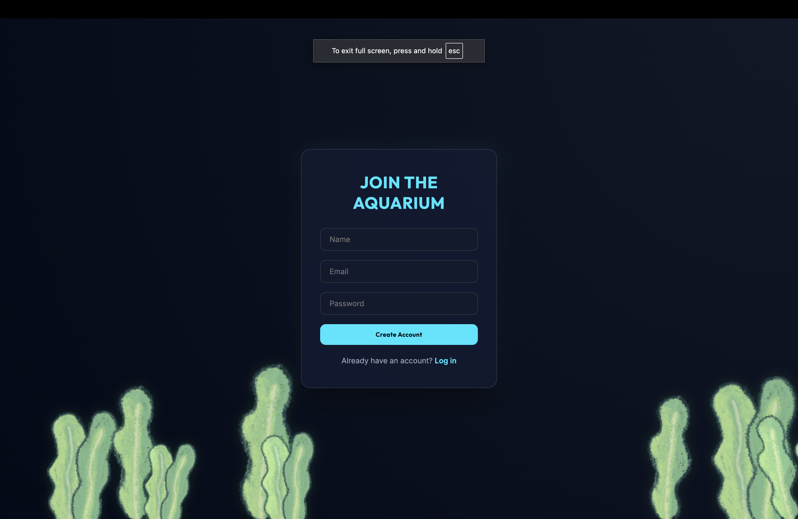
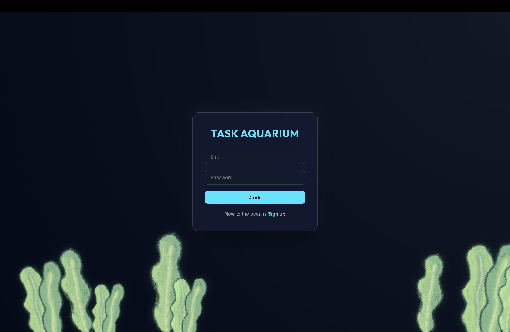
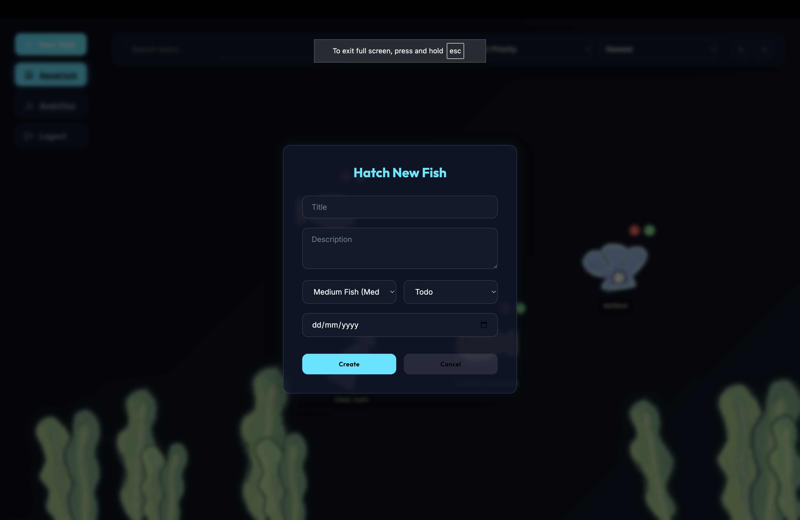
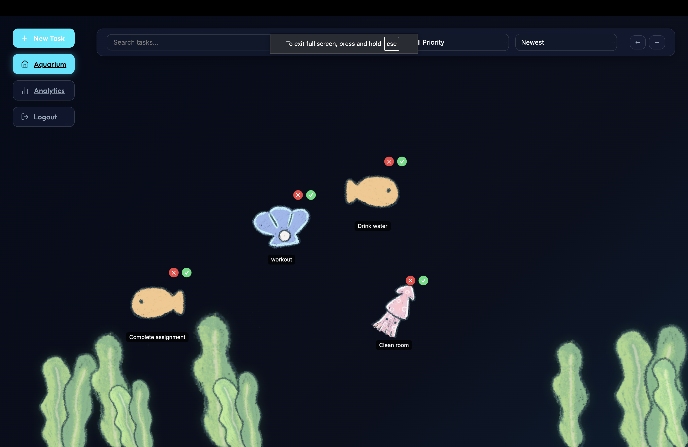
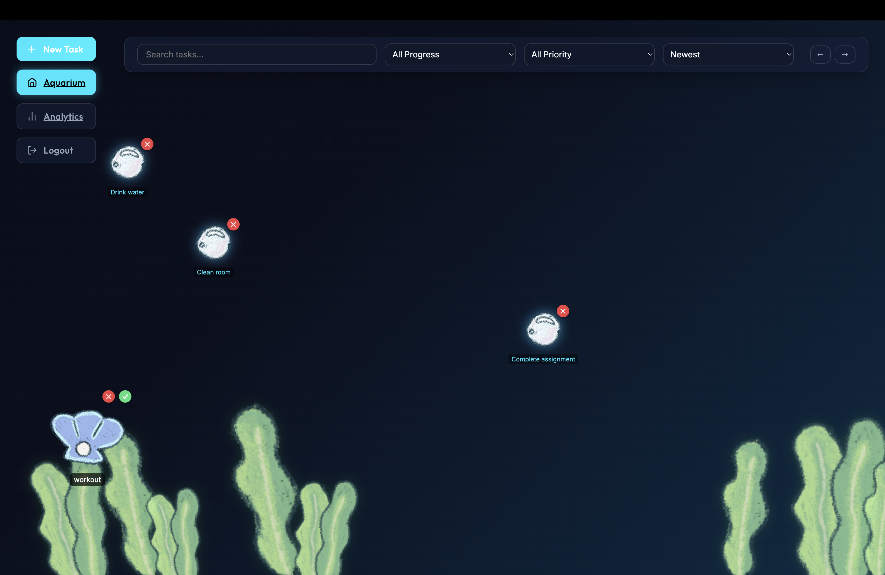
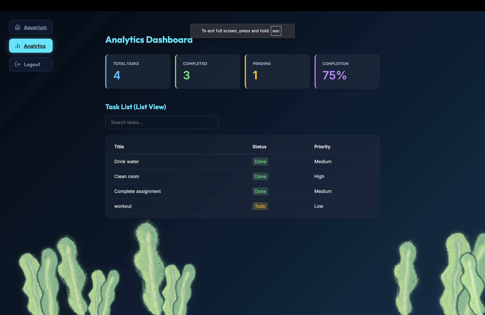

# 🌊 Gamified Aquarium Task Manager

A full-stack (MERN) Task Management Web Application built as a mini-project assignment. This application features a unique, immersive "Aquarium" UI where tasks are represented as swimming fish, and completed tasks transform into floating bubbles.

**Live Demo:** [https://taskmanagement-github-io.onrender.com](https://taskmanagement-github-io.onrender.com)

---

## 🛠️ Tech Stack
- **Frontend**: React.js (Vite), Axios, React Router, Vanilla CSS (Glassmorphism).
- **Backend**: Node.js, Express.js (v5), JWT Authentication.
- **Database**: MongoDB (Mongoose ODM).
- **Deployment**: Render (Unified Web Service), MongoDB Atlas.

---

## 📸 Visual Walkthrough

### 1. Join the Ocean (Signup)

*Start your productivity journey by creating a personalized aquarium account.*

### 2. Secure Access (Login)

*A premium, glassmorphism-styled portal to keep your tasks secure.*

### 3. Your Personal Reservoir

*A clean, immersive space ready for your daily goals.*

### 4. Tasks as Swimming Fish

*Watch your tasks come to life! Different fish types and sizes represent task priorities and status.*

### 5. Achieving Goals (Bubbles)

*When a task is done, it transforms into a floating bubble, providing satisfying visual feedback.*

### 6. Data-Driven Insights

*Monitor your progress with a minimalist analytics dashboard and list view.*

---

## 📦 Installation & Setup

### 1. Database Configuration
1.  Create a **MongoDB Atlas** cluster.
2.  Add a database user.
3.  In **Network Access**, allow access from anywhere (`0.0.0.0/0`) if deploying to Render.
4.  Copy your Connection String.

### 2. Local Environment Setup
1.  Clone the repository:
    ```bash
    git clone https://github.com/bhavyanjain3004/TaskManagement.github.io.git
    cd TaskManagement.github.io
    ```
2.  Configure `.env` in the `/backend` folder:
    ```env
    PORT=5001
    MONGO_URI=your_mongodb_connection_string
    JWT_SECRET=super_secret_aquarium_key
    ```
3.  Install and Run:
    ```bash
    npm run install-all  # Installs both Backend and Frontend deps
    npm run dev          # Starts both servers with a single command
    ```

### 3. Production Deployment (Render)
1.  Connect your GitHub repo to Render.
2.  **Build Command**: `npm run build`
3.  **Start Command**: `npm run start`
4.  **Environment Variables**: Add `MONGO_URI`, `JWT_SECRET`, and `NODE_ENV=production`.

---

## 🛠️ API Endpoints

### Authentication
- `POST /api/auth/register`: Signup a new user.
- `POST /api/auth/login`: Authenticate and receive a JWT.
- `GET /api/auth/me`: Get current user profile (Protected).

### Task Management (Protected)
- `GET /api/tasks`: Get all tasks (Supports `search`, `status`, `priority`, `sort`, and `page` params).
- `POST /api/tasks`: Create a new task.
- `PUT /api/tasks/:id`: Update an existing task or complete it.
- `DELETE /api/tasks/:id`: Permanently remove a task.
- `GET /api/tasks/analytics`: get summary statistics (Total, Todo, Done).

---

## 🎨 Design Decisions

### 1. The Aquarium Metaphor
Traditional task managers are often stressful and cluttered. By using an **Aquarium metaphor**, we've transformed "to-dos" into living elements. This gamification makes completing a task (turning a fish into a bubble) feel rewarding rather than just checking a box.

### 2. Glassmorphism Design System
We opted for a **Premium Glassmorphism** aesthetic (`backdrop-filter`) to mimic the look of an actual high-end glass aquarium. This gives the application a depth and translucency that feels more immersive than a flat UI.

### 3. Technical Choices
- **Express 5**: We chose the latest Express 5 for improved performance and modern Error Handling, despite it requiring a different approach to wildcard routing for our SPA.
- **Monorepo Strategy**: Using a root `package.json` simplified our CI/CD pipeline on Render, allowing us to manage two separate codebases as a single deployable unit.
- **MongoDB Indexing**: We strategically added compound indexes on `userId` + `status` to ensure our "aquarium" remains fast even with thousands of fish.

---

## 📄 License
This project is for assignment purposes.

